# FAZA 3 - Visual Diagrams

## System Architecture Diagrams

### High-Level System Context

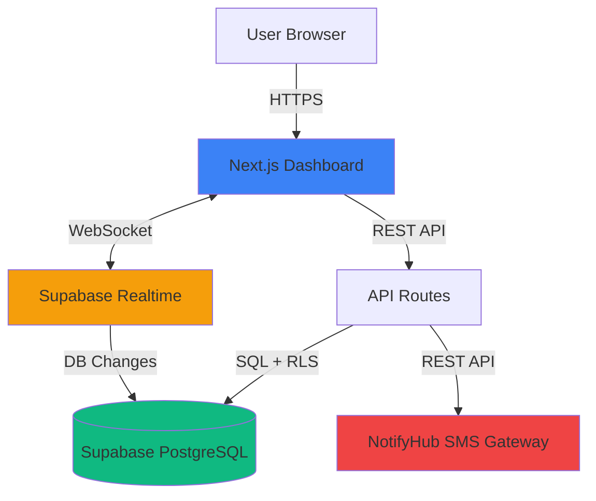

### Component Architecture

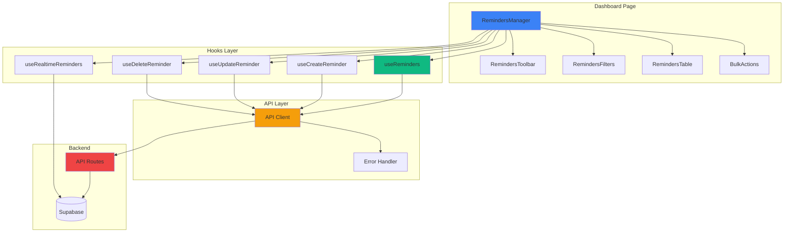

---

## Data Flow Diagrams

### Create Reminder Flow (Optimistic Update)

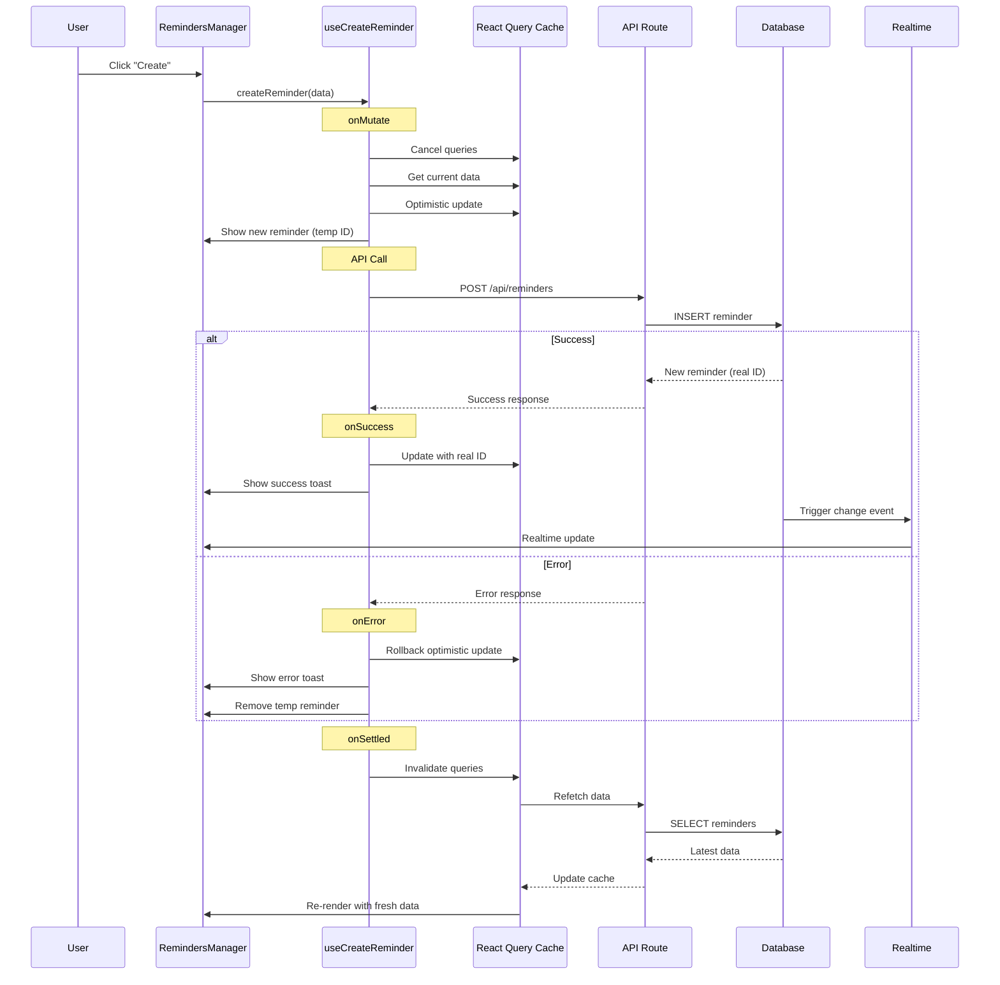

### Real-time Sync Flow

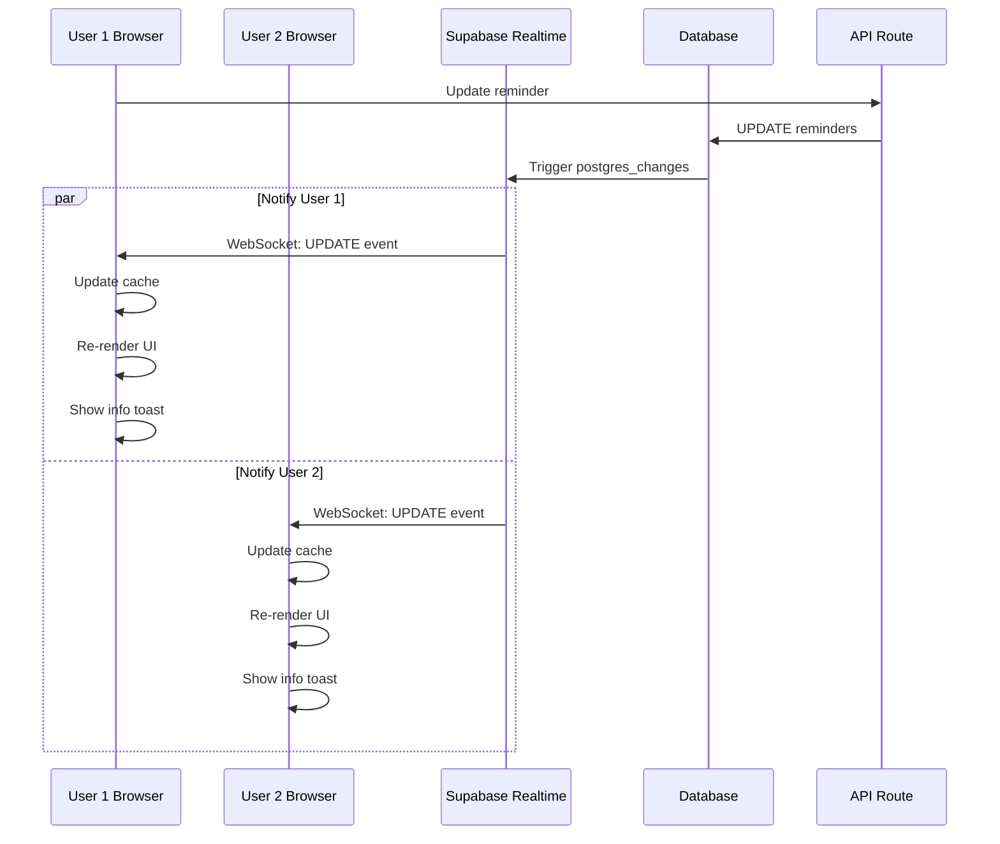

### SMS Send Flow

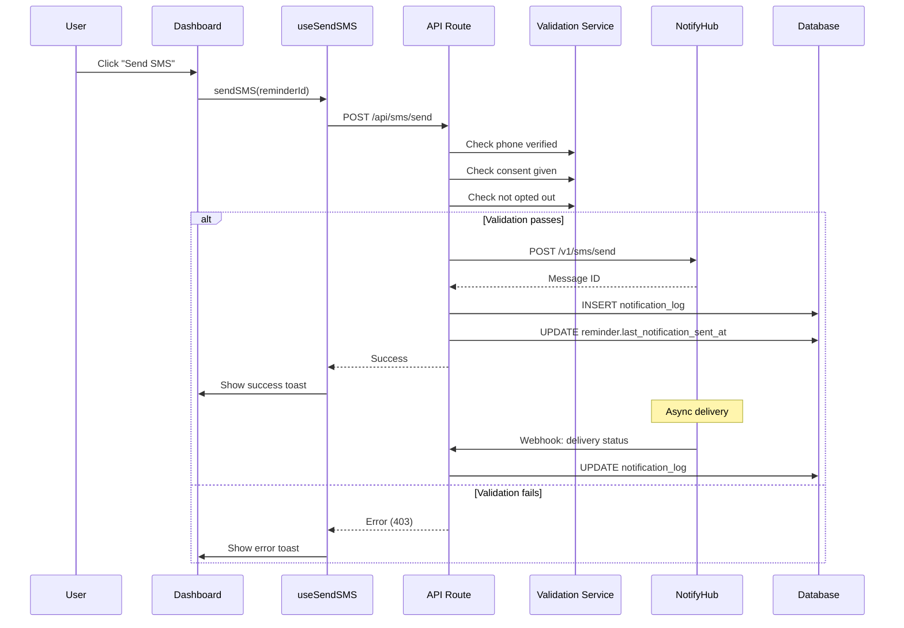

---

## State Management Architecture

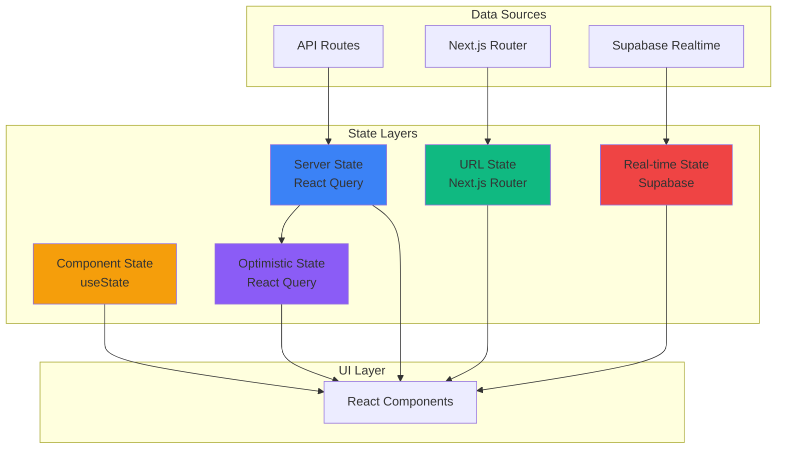

---

## Component Interaction Diagram

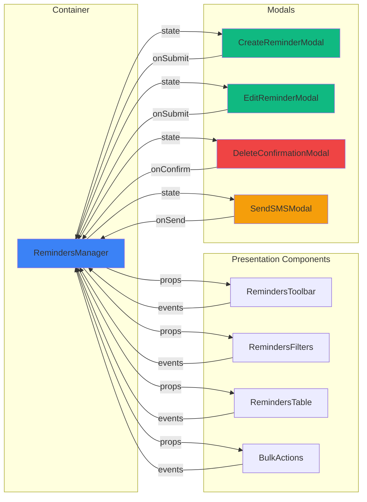

---

## Error Handling Flow

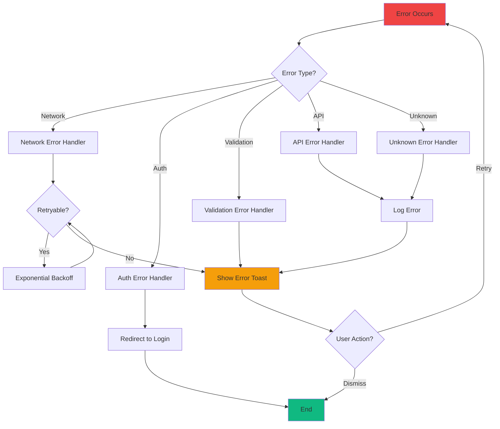

---

## SMS Integration Architecture

```mermaid
graph TB
    subgraph "Dashboard"
        UI[User Interface]
        Hook[useSendSMS Hook]
    end

    subgraph "API Layer"
        Route[/api/sms/send]
        Validation[Validation Service]
        SMSService[SMS Service]
    end

    subgraph "External Services"
        NotifyHub[NotifyHub API]
    end

    subgraph "Database"
        Reminders[(reminders)]
        Logs[(notification_log)]
    end

    UI -->|Send SMS| Hook
    Hook -->|POST| Route

    Route --> Validation
    Validation -->|Check consent| Reminders
    Validation -->|Check verification| Reminders

    Route --> SMSService
    SMSService -->|Build message| SMSService
    SMSService -->|POST /v1/sms/send| NotifyHub

    NotifyHub -->|Message ID| SMSService
    SMSService -->|Log| Logs
    SMSService -->|Update| Reminders

    NotifyHub -.->|Webhook| Route
    Route -.->|Update status| Logs

    style UI fill:#3b82f6
    style NotifyHub fill:#ef4444
    style Validation fill:#f59e0b
    style Reminders fill:#10b981
```

---

## Filter & Search Architecture

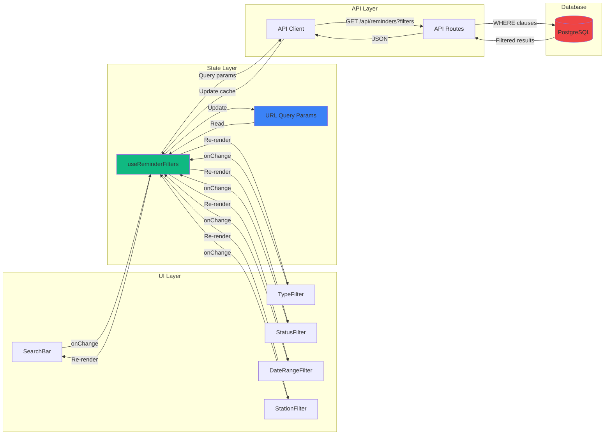

---

## Security Architecture

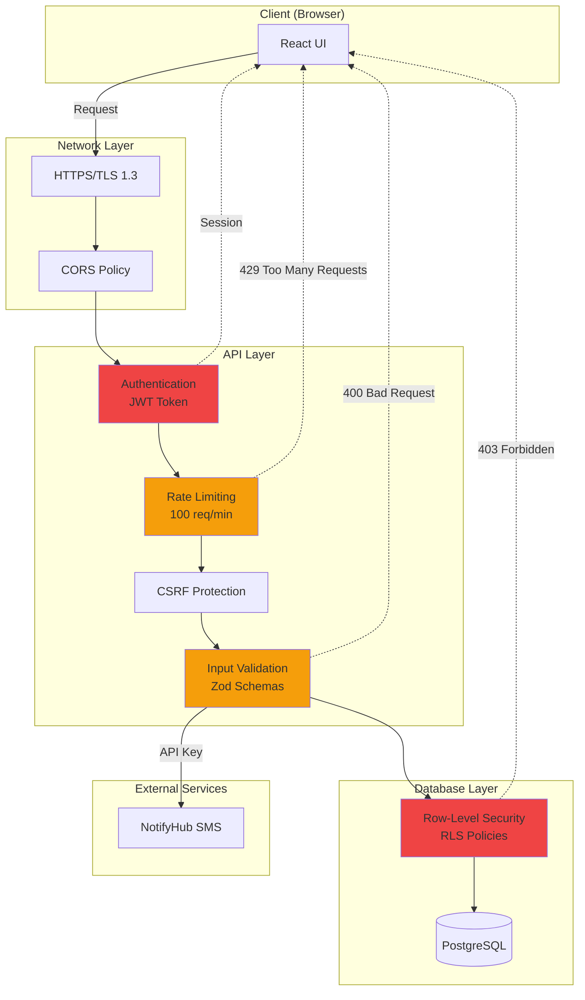

---

## Performance Optimization Flow

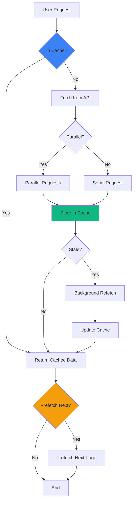

---

## Deployment Architecture

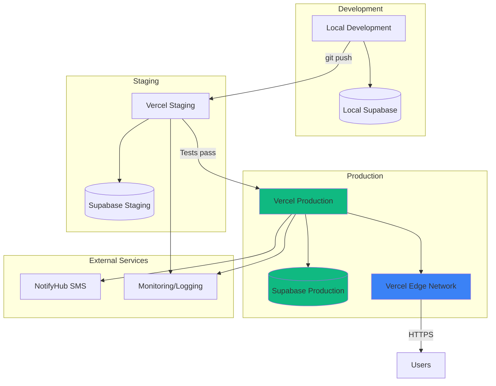

---

## Database Schema Relationships

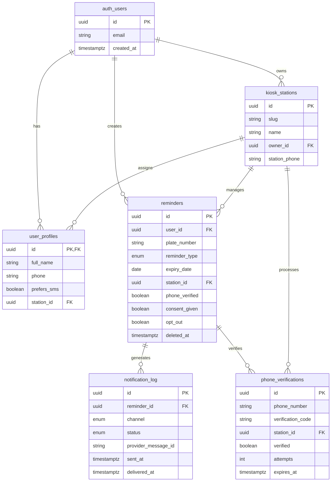

---

## Testing Strategy

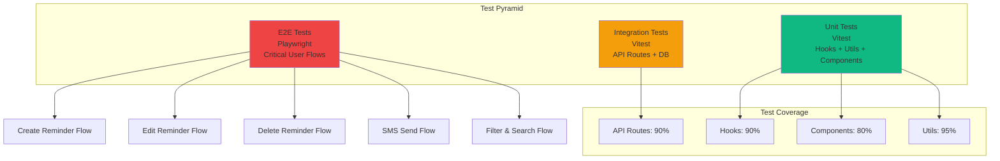

---

**Note:** These diagrams are created using Mermaid syntax. They can be rendered in:
- GitHub (native support)
- VS Code (with Mermaid extension)
- Documentation sites (Docusaurus, VuePress, etc.)
- Mermaid Live Editor (https://mermaid.live)

---

**Last Updated:** 2025-11-04
**See Also:**
- Full Architecture: `FAZA3_ARCHITECTURE.md`
- Quick Reference: `FAZA3_QUICK_REFERENCE.md`
